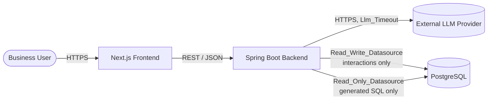
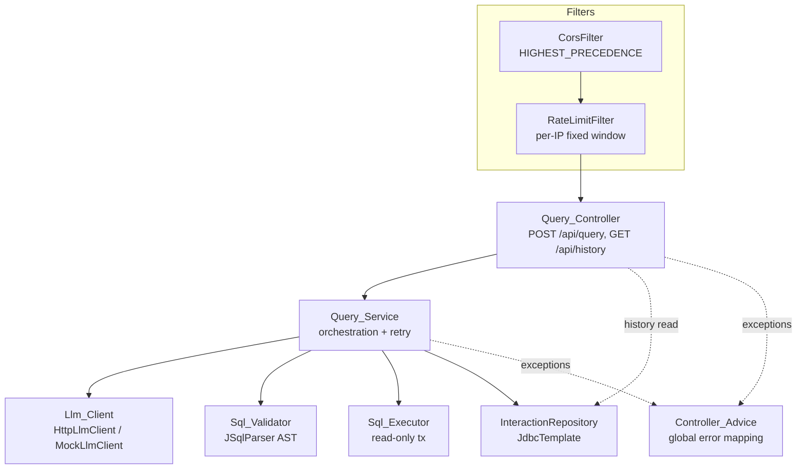
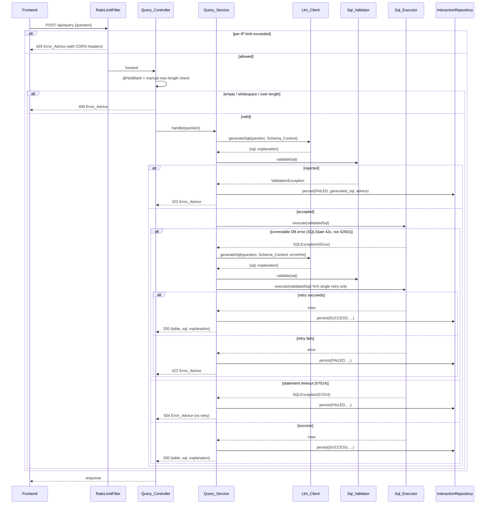

# Design Document

## Overview

AI SQL Analyst is a two-tier web application. A **Next.js** frontend calls a **Spring Boot** backend over a REST API, and the backend talks to a single **PostgreSQL** database. The backend turns a plain-English Question into a single read-only `SELECT`, validates it for safety, executes it through a dedicated read-only database role, and persists every Interaction for later review.

The design favors a deliberately minimal stack:

- **Spring Boot** starters: `spring-boot-starter-web`, `spring-boot-starter-validation`, `spring-boot-starter-jdbc` (JdbcTemplate, no JPA/Hibernate).
- **JSqlParser** for AST-based SQL validation (no regex matching of SQL).
- **One LLM HTTP client** built on Spring's `RestClient`/`WebClient` with a configurable timeout; an optional in-process mock implementation for local development.
- **HikariCP** (bundled with Spring Boot) for both datasources.

Safety is the organizing principle. Generated SQL only ever runs through a read-only role that cannot see the Interactions_Table, every statement is parsed and allowlisted before execution, and execution is bounded by an enforced row limit and a per-statement timeout. Secrets arrive through environment variables, startup fails fast when a required variable is missing, and no response ever carries a secret or a stack trace.

This document reproduces the agreed minimal-stack design and then records a set of refinements agreed during review (retry classification, schema-qualified table checks, CORS ordering, manual length validation, datasource wiring, init-script shell wrapper, frontend build args, column rename, an optional mock LLM client, and README operational notes).

### Requirements Coverage Map

| Area | Requirements |
|------|--------------|
| Question-to-answer flow | 1 |
| Database init & sample data | 2 |
| Datasource separation | 3 |
| SQL safety validation | 4 |
| Retry on correctable errors | 5 |
| Interaction persistence | 6 |
| History retrieval | 7 |
| LLM failure handling | 8 |
| Rate limiting | 9 |
| Configuration | 10 |
| Startup validation & response safety | 11 |
| Backend structure | 12 |
| Frontend experience | 13 |
| Automated testing | 14 |
| Operational tooling & docs | 15 |

## Architecture

### System Context



The frontend never talks to the LLM or the database directly. All orchestration, validation, and persistence happen in the backend. The backend holds two distinct database connections to the same PostgreSQL instance: a read-write connection used only for the Interactions_Table, and a read-only connection (authenticated as the Read_Only_Role) used only to run generated SQL. _(Requirements 3.1, 3.2)_

### Backend Layering



Request flow through filters: a dedicated **CorsFilter** runs first (at `Ordered.HIGHEST_PRECEDENCE`), then the **RateLimitFilter** (a lower precedence). Placing CORS before rate limiting guarantees that even a `429 Too Many Requests` response carries CORS headers, so the browser can read the body and status instead of surfacing an opaque CORS error. _(Change 5; Requirements 9.1, 10.6)_

Layers and components are explicitly separated — a controller layer and a service layer, with Sql_Validator, Sql_Executor, and Llm_Client as independent components, Request/Response DTOs, and a global Controller_Advice. _(Requirements 12.1–12.4)_

### POST /api/query Sequence (with single retry)



_(Requirements 1.1, 5.1–5.4, 4.8, 6.1–6.4, 8.x)_

## Components and Interfaces

### Query_Controller

Exposes the two REST endpoints and performs request-shape validation.

```java
@RestController
@RequestMapping("/api")
class QueryController {
    @PostMapping("/query")
    QueryResponse query(@Valid @RequestBody QueryRequest request); // 1.1–1.3

    @GetMapping("/history")
    List<InteractionSummary> history();                            // 7.1, 7.2
}
```

- `@Valid` triggers Bean Validation (`@NotBlank`) on the request body.
- The **manual max-length check** against the configurable `Max_Question_Length` happens here (or at the top of the service), throwing a `QuestionTooLongException` that the advice maps to HTTP 400. See Change 6 under Data Models for the rationale. _(Requirements 1.2, 1.3)_

### Query_Service

Orchestrates the full flow: LLM generation, validation, execution, the single retry, status/latency bookkeeping, and persistence.

```java
@Service
class QueryService {
    QueryResponse handle(String question);
}
```

Pseudocode (illustrative, not production code):

```text
handle(question):
    start = now()
    enforceMaxLength(question)              # throws -> 400 (Change 6)
    generatedSql = null
    try:
        resp = llmClient.generateSql(question, schemaContext)   # 8.x on failure
        generatedSql = resp.sql
        validated = sqlValidator.validate(generatedSql)         # 4.x -> 422 on reject (no retry)
        try:
            rows = sqlExecutor.execute(validated)
        catch SQLException e:
            if isCorrectable(e):                                # SQLState class 42, not 42501 (Change 2)
                resp2 = llmClient.generateSql(question, schemaContext, hintFrom(e))
                generatedSql = resp2.sql
                validated2 = sqlValidator.validate(resp2.sql)   # re-validate (4.x)
                rows = sqlExecutor.execute(validated2)          # single retry only (5.1)
            else if isStatementTimeout(e):                      # SQLState 57014 (Change 2)
                throw StatementTimeoutException                 # -> 504, no retry (5.2)
            else:
                throw                                           # -> 422 (5.4) / mapped by advice
        persist(SUCCESS, question, generatedSql, summarize(rows), resp.explanation, latency(start))  # 6.1
        return QueryResponse(table(rows), generatedSql, resp.explanation)
    catch ValidationException ve:
        persist(FAILED, question, generatedSql, ve.message, null, latency(start))                    # 6.2
        throw ve                                                 # -> 422 (4.8, 5.3)
    catch LlmException le:
        persist(FAILED, question, generatedSql /*maybe null*/, le.advice, null, latency(start))      # 6.2, 6.4
        throw le                                                 # -> 502/503 per 8.x
    catch StatementTimeoutException te:
        persist(FAILED, question, generatedSql, te.advice, null, latency(start))                      # 6.2
        throw te                                                 # -> 504
```

**Correctable-error classification (Change 2).** Retry occurs when, and only when, execution fails with a `SQLException` whose `SQLState` is in **class `42`** (syntax error or access rule violation family), **except `42501` (insufficient_privilege)** which must never be retried because it signals an attempt to touch something the Read_Only_Role is denied. Representative retryable states to recognize:

| SQLState | Meaning | Retry? |
|----------|---------|--------|
| 42601 | syntax_error | yes |
| 42703 | undefined_column | yes |
| 42803 | grouping_error | yes |
| 42883 | undefined_function | yes |
| 42804 | datatype_mismatch | yes |
| 42702 | ambiguous_column | yes |
| 42501 | insufficient_privilege | **no** (not correctable; mapped as failure) |
| 57014 | query_canceled / statement_timeout | **no** → HTTP 504 |

Validator rejection is never retried (→ 422). The retry is strictly single: one corrected statement, re-validated and re-executed; if it also fails, the backend returns HTTP 422. _(Requirements 5.1–5.4)_

### Llm_Client

A single interface with a real HTTP implementation and an **optional mock implementation** (Change 11).

```java
interface LlmClient {
    LlmResult generateSql(String question, String schemaContext);
    LlmResult generateSql(String question, String schemaContext, String errorHint); // retry path
}

record LlmResult(String sql, String explanation) {}
```

- **HttpLlmClient** (default): calls the configured provider over HTTPS, applies the configurable `Llm_Timeout` to each call, and parses the provider response into `{sql, explanation}`. It maps provider/parse failures to typed exceptions that the advice turns into safe statuses:

  | Condition | HTTP | Requirement |
  |-----------|------|-------------|
  | Llm_Timeout exceeded | 503 | 8.2 |
  | Provider rate-limit error | 503 | 8.3 |
  | Provider authentication error | 502 | 8.4 |
  | Llm_Response not valid JSON | 502 | 8.5 |
  | Llm_Response missing `sql` | 502 | 8.6 |
  | Llm_Response missing `explanation` | 502 | 8.7 |

  Error_Advice messages omit all internal details (provider name, keys, raw bodies, stack traces). _(Requirements 8.1–8.7, 11.2, 11.3)_

- **MockLlmClient** (optional, Change 11): selected when `LLM_PROVIDER=mock`. It returns deterministic `{sql, explanation}` suitable for local development and demos without a real provider or network. When `LLM_PROVIDER=mock`, the provider secrets (`LLM_API_KEY`, `LLM_BASE_URL`, `LLM_MODEL`) are **not** required at startup (see Configuration fail-fast logic). The default remains the real `HttpLlmClient`.

  > This optional mock is a deliberate, scoped relaxation of the earlier "single implementation only" guidance. It exists solely to enable local dev/testing and is never selected unless `LLM_PROVIDER=mock` is set explicitly.

Both implementations include the **Schema_Context** (Allowlisted_Tables and their columns) in the generation request. _(Requirement 1.4)_ Bean selection is via `@ConditionalOnProperty(name="LLM_PROVIDER", havingValue="mock")` for the mock and the default `HttpLlmClient` otherwise.

### Sql_Validator

AST-based validation using JSqlParser — the SQL text is parsed, never regex-matched. _(Requirement 4)_

```java
@Component
class SqlValidator {
    ValidatedSql validate(String sql); // throws ValidationException on any rule failure
}
```

Rules enforced:

1. **Single statement** — reject multi-statement input. _(4.1)_
2. **SELECT only** — the parsed statement must be a `Select` (or a `SetOperationList` whose branches are all selects); reject INSERT/UPDATE/DELETE/DDL/etc. _(4.2)_
3. **Allowlisted, schema-qualified tables (Change 4)** — every referenced table is checked by its **schema-qualified** name. A table whose schema is `pg_catalog`, `information_schema`, or any non-allowlisted schema is rejected, not merely by bare name. Unqualified names resolve against the allowlisted application schema; names on the Allowlisted_Tables set (`customers`, `products`, `orders`, `order_items`) are accepted. _(4.3)_
4. **No `SELECT INTO`** — reject. _(4.4)_
5. **No locking clause** — reject `FOR UPDATE`/`FOR SHARE`/etc. _(4.5)_
6. **Default-deny function allowlist** — accept a function only if its name is in Allowlisted_Functions; reject every other function, including Dangerous_Functions. _(4.6, 4.7)_
7. **Set operations (Change 4)** — when the statement is a `SetOperationList` (UNION / UNION ALL / INTERSECT / EXCEPT), traverse **every branch** and validate each branch's tables and functions. No branch may escape the table/function/schema checks.

The validator walks the AST (via JSqlParser visitors) to collect every table reference (including those inside subqueries, joins, CTEs, and set-operation branches) and every function invocation, then applies the allowlists. On any failure it throws `ValidationException` carrying a safe Error_Advice; the advice maps it to HTTP 422. _(Requirement 4.8)_

### Sql_Executor

Executes validated SQL inside a read-only transaction on the Read_Only_Datasource, bounded by the Enforced_Limit and the Statement_Timeout. _(Requirements 3.2, 4.9, 10.3, 10.4)_

```java
@Component
class SqlExecutor {
    @Transactional(readOnly = true, transactionManager = "readOnlyTxManager") // Change 7
    List<Map<String,Object>> execute(ValidatedSql sql);
}
```

Execution details:

- **Transaction manager (Change 7).** The `@Transactional` annotation explicitly names `transactionManager = "readOnlyTxManager"` so the read-only datasource's transaction manager is used, not the default (read-write) one.
- **Executed statement form (Change 3).** The executor runs the **parsed statement's string form** — `statement.toString()` from JSqlParser, which is guaranteed to carry **no trailing semicolon** — placed inside the limit-wrapper subquery. Running the normalized AST text (rather than the raw LLM string) removes any trailing-semicolon or stray-token ambiguity before wrapping.
- **Enforced_Limit via subquery wrap.** The validated statement is wrapped as:

  ```sql
  SELECT * FROM ( <statement.toString()> ) AS _wrapped LIMIT <Enforced_Limit>
  ```

  Default limit 100, configurable. _(10.3)_
- **Belt-and-suspenders row cap (Change 3).** In addition to the outer `LIMIT`, the executor sets the JDBC max-rows cap (`statement.setMaxRows(limit)` / `JdbcTemplate.setMaxRows(limit)`) so the driver stops fetching past the cap even if the wrapper were somehow bypassed.
- **Statement_Timeout.** The executor issues `SET LOCAL statement_timeout = <ms>` at the start of the read-only transaction (default 5s, configurable). A timeout surfaces as `SQLException` with `SQLState 57014`, which the service maps to HTTP 504 with no retry. _(10.4, 5.2)_
- Because the connection authenticates as the Read_Only_Role, any reference to the Interactions_Table or any write is denied by PostgreSQL itself. _(3.3, 3.4)_

### InteractionRepository

JdbcTemplate-backed repository bound to the Read_Write_Datasource. _(Requirements 3.1, 6.x, 7.x)_

```java
@Repository
class InteractionRepository {
    void save(Interaction interaction);          // 6.1–6.4
    List<InteractionSummary> findRecent(int n);  // 7.1 (n = 50, newest-first)
}
```

### Controller_Advice

Global `@ControllerAdvice` that maps typed exceptions to HTTP statuses and safe Error_Advice bodies, never leaking secrets or stack traces. _(Requirements 11.2, 11.3, 12.4)_ See the Error Handling section for the full mapping.

### CorsFilter / RateLimitFilter

- **CorsFilter (Change 5):** a dedicated `CorsFilter` bean registered at `Ordered.HIGHEST_PRECEDENCE`, permitting the configured `Frontend_Origin`. _(10.6)_
- **RateLimitFilter:** per-IP fixed-window limiter, registered at a lower precedence than CORS so 429 responses still receive CORS headers. _(9.1)_ See Data Models for the limiter structure.

## Data Models

### Request / Response DTOs

```java
record QueryRequest(
    @NotBlank String question   // Change 6: no @Size here
) {}

record QueryResponse(
    List<Map<String,Object>> table,
    String sql,
    String explanation
) {}

record InteractionSummary(
    long id,
    String question,
    String generatedSql,   // Change 10: renamed from `sql`; nullable
    String resultSummary,
    String explanation,
    String status,
    long latencyMs,
    Instant createdAt
) {}
```

**Change 6 — manual max-length validation (and why).** `QueryRequest.question` keeps `@NotBlank` (covering empty/whitespace → 400) but **drops the `@Size` placeholder**. Bean Validation `@Size(max=...)` requires a compile-time constant and cannot cleanly read a runtime-configurable value like `Max_Question_Length`. Instead, the controller/service performs a manual length check against the injected configurable `Max_Question_Length`; exceeding it throws `QuestionTooLongException`, which the advice maps to HTTP 400 with the max-length Error_Advice. _(Requirements 1.2, 1.3, 10.2)_

### Interactions_Table (Change 10 applied)

```sql
CREATE TABLE interactions (
    id             BIGSERIAL PRIMARY KEY,
    question       TEXT        NOT NULL,
    generated_sql  TEXT        NULL,          -- renamed from `sql`; nullable (6.3)
    result_summary TEXT        NULL,
    explanation    TEXT        NULL,
    status         VARCHAR(16) NOT NULL,      -- Status_Field: SUCCESS | FAILED
    latency_ms     BIGINT      NULL,          -- Latency_Field
    created_at     TIMESTAMPTZ NOT NULL DEFAULT now()
);
```

The `generated_sql` column (formerly `sql`) is renamed everywhere — the DDL above, the history query, the `InteractionSummary.generatedSql` field, and all references — and remains nullable so it can be null when no SQL was generated. _(Requirements 6.1–6.4, Change 10)_

**History query (Change 10 applied):**

```sql
SELECT id, question, generated_sql, result_summary, explanation,
       status, latency_ms, created_at
FROM interactions
ORDER BY created_at DESC, id DESC
LIMIT 50;
```

Read through the Read_Write_Datasource, newest-first, capped at 50. _(Requirements 7.1, 7.2)_

### Rate Limiter State

In-memory, per-IP, fixed-window limiter — no external store. _(Requirements 9.1, 9.2)_

```text
ConcurrentHashMap<String /*clientIp*/, Window>
Window { long windowStartEpochMs; AtomicInteger count; }
window length = 60s
default Rate_Limit = 30 requests / minute / IP  (app.rate-limit.requests-per-minute, configurable)
on exceed -> HTTP 429 with descriptive Error_Advice
trusted-proxy flag: default OFF (app.rate-limit.trust-proxy)
```

When the trusted-proxy flag is OFF, the client IP is the socket remote address. When ON, the limiter trusts a forwarded header (e.g. `X-Forwarded-For`) to obtain the real client IP behind a reverse proxy/load balancer. See README notes (Change 12).

### Allowlisted_Functions (default set)

Default-deny: a function is accepted only if its name appears below. _(Requirements 4.6, 4.7)_

| Category | Functions |
|----------|-----------|
| Aggregates | `count`, `sum`, `avg`, `min`, `max` |
| String | `lower`, `upper`, `trim`, `length`, `substring`, `concat`, `left`, `right`, `replace` |
| Null / conditional | `coalesce`, `nullif`, `greatest`, `least` |
| Numeric | `round`, `ceil`, `floor`, `abs` |
| Date / time | `now`, `date_trunc`, `extract`, `date_part`, `age`, `to_char` |
| Cast | `cast` |

**Explicitly excluded** (and anything else not listed above — default-deny): `pg_sleep`, `pg_read_file`, `pg_read_binary_file`, `pg_ls_dir`, `pg_stat_file`, `lo_import`, `lo_export`, `dblink`, `current_setting`, `set_config`.

### Schema_Context

A static description of the Allowlisted_Tables and their columns, assembled at startup and included in every LLM generation request. _(Requirement 1.4)_

## Correctness Properties

*A property is a characteristic or behavior that should hold true across all valid executions of a system — essentially, a formal statement about what the system should do. Properties serve as the bridge between human-readable specifications and machine-verifiable correctness guarantees.*

Per the approved testing decision, property-based testing is deliberately scoped to the Sql_Validator and limited to the **two** properties below. Every other testable acceptance criterion is covered by the plain JUnit example tests (Sql_Validator 5 cases, Query_Service 6 cases with a mocked Llm_Client) and the integration/smoke tests described in the Testing Strategy. The previously-considered properties for persistence round-trips, history ordering, rate limiting, and retry behavior have been **dropped as properties and are instead covered by example/JUnit tests**.

### Property 1: Non-SELECT statements are always rejected

*For any* syntactically parseable SQL statement that is not a `SELECT` (for example INSERT, UPDATE, DELETE, DROP, CREATE, ALTER, TRUNCATE), the Sql_Validator SHALL reject it.

**Validates: Requirements 4.2**

### Property 2: Non-allowlisted functions are always rejected

*For any* otherwise-valid single `SELECT` over an allowlisted table that invokes at least one function whose name is not a member of the Allowlisted_Functions set (including Dangerous_Functions such as `pg_sleep` or `pg_read_file`), the Sql_Validator SHALL reject it.

**Validates: Requirements 4.6, 4.7**

> Properties 1 and 2 are independent: Property 1 quantifies over statement types, Property 2 over the function-name space within valid SELECTs. Neither subsumes the other. All remaining acceptance criteria are validated through example tests rather than properties.

## Error Handling

The Controller_Advice centralizes mapping. Every body is a safe Error_Advice with no secret and no stack trace. _(Requirements 11.2, 11.3)_

| Condition | Exception | HTTP | Requirement |
|-----------|-----------|------|-------------|
| Empty / whitespace question | `MethodArgumentNotValidException` (`@NotBlank`) | 400 | 1.3 |
| Question exceeds Max_Question_Length | `QuestionTooLongException` (manual check, Change 6) | 400 | 1.2 |
| Validator rejects SQL (any rule) | `ValidationException` | 422 | 4.8, 5.3 |
| Correctable DB error, retry also fails | `QueryFailedException` | 422 | 5.4 |
| Non-correctable, non-timeout DB error | `QueryFailedException` | 422 | 5.4 |
| Statement_Timeout (SQLState 57014) | `StatementTimeoutException` | 504 | 5.2 |
| LLM timeout | `LlmTimeoutException` | 503 | 8.2 |
| LLM provider rate-limit | `LlmRateLimitException` | 503 | 8.3 |
| LLM provider auth error | `LlmAuthException` | 502 | 8.4 |
| Llm_Response invalid JSON | `LlmParseException` | 502 | 8.5 |
| Llm_Response missing `sql` | `LlmParseException` | 502 | 8.6 |
| Llm_Response missing `explanation` | `LlmParseException` | 502 | 8.7 |
| Per-IP rate limit exceeded | handled in RateLimitFilter | 429 | 9.1 |

Retry classification (SQLState class 42 except 42501) is detailed in the Query_Service section (Change 2). Each failed flow, including failures before SQL generation, persists an Interaction with the FAILED Status_Field and an Error_Advice-based result summary. _(Requirements 6.2, 6.4)_

## Testing Strategy

The testing approach pairs a small, focused set of plain JUnit example tests with at most two optional property-based tests. This reflects the approved decision (Change 1).

### Required unit tests (plain JUnit)

**Sql_Validator — 5 cases** _(Requirement 14.1)_

1. Valid single SELECT over allowlisted tables → accepted.
2. Multi-statement input → rejected. _(4.1)_
3. Non-SELECT statement → rejected. _(4.2)_
4. Non-allowlisted table (including `pg_catalog.*` / `information_schema.*`, Change 4) → rejected. _(4.3)_
5. Non-allowlisted / dangerous function (e.g. `pg_sleep`) → rejected. _(4.6, 4.7)_

**Query_Service — 6 cases, with a mocked Llm_Client** _(Requirement 14.2)_

1. Success: generate → validate → execute → 200 with table/sql/explanation, persisted SUCCESS. _(1.1, 6.1)_
2. Validator rejection → 422, no retry, persisted FAILED. _(4.8, 5.3)_
3. Correctable error (SQLState class 42, e.g. 42703) then retry success → 200. _(5.1)_
4. Retry fails → 422. _(5.4)_
5. Statement timeout (57014) → 504, no retry. _(5.2)_
6. LLM malformed/provider failure (e.g. missing `sql` / timeout) → mapped per the Error Handling table (502/503). _(8.x)_

### Optional property-based tests (jqwik, at most 2)

Property-based testing uses **jqwik** for Java. We do not implement PBT from scratch. Each property test runs a minimum of **100 iterations** and is tagged referencing its design property.

- **Property 1 test** — generate random non-SELECT statements across DML/DDL; assert the validator rejects every one.
  - Tag: `Feature: ai-sql-analyst, Property 1: Non-SELECT statements are always rejected`
- **Property 2 test** — generate valid SELECTs over an allowlisted table that call a randomly chosen non-allowlisted function name; assert rejection.
  - Tag: `Feature: ai-sql-analyst, Property 2: Non-allowlisted functions are always rejected`

These two properties are optional. If PBT is dropped entirely, the five Sql_Validator JUnit cases above still cover the same acceptance criteria with concrete examples.

### Integration tests (against a test PostgreSQL)

- Datasource separation: the Read_Only_Datasource cannot modify any table and cannot read the Interactions_Table; the Read_Write_Datasource reads/writes interactions only. _(3.1–3.4)_
- Executor bounds: Enforced_Limit caps rows (outer LIMIT and JDBC maxRows, Change 3), read-only transaction via `readOnlyTxManager` (Change 7), `SET LOCAL statement_timeout` applied. _(4.9, 10.3, 10.4)_
- Init_Script: schema, Interactions_Table, ≥2000 seed rows, Read_Only_Role with SELECT only on allowlisted tables and no privilege on interactions. _(2.1–2.5)_
- History: newest-first, limited to 50, read through the read-write connection. _(7.1, 7.2)_

### Other tests

- RateLimitFilter unit test: the (N+1)th request within the window from one IP → 429; threshold is configurable. _(9.1, 9.2)_
- Startup/config: a missing Required_Environment_Variable fails startup and names the variable; advice tests assert no secret and no stack trace in any body. With `LLM_PROVIDER=mock`, provider secrets are not required (Change 11). _(11.1–11.3, 10.x)_
- Frontend component/interaction tests: form validation, example-question populate+submit, loading/disabled submit, collapsible SQL collapsed by default, recent-questions list, responsive layout. _(13.x)_

### CI

A GitHub Actions workflow builds the system and runs the required Sql_Validator and Query_Service tests (and the optional property tests when present). _(Requirements 14.3, 15.4)_

## Configuration

Secrets and tunables come from environment variables. The backend validates required variables at startup and fails fast, naming any missing variable. _(Requirements 10.1–10.6, 11.1)_

### Backend environment variables

| Variable | Required | Default | Purpose |
|----------|----------|---------|---------|
| `DB_URL` (jdbc-url, Change 7) | yes | — | PostgreSQL JDBC URL for both datasources |
| `DB_RW_USER` | yes | — | Read-write (app) role username (interactions) |
| `DB_RW_PASSWORD` | yes | — | Read-write role password |
| `DB_RO_USER` | yes | — | Read-only role username (generated SQL) |
| `DB_RO_PASSWORD` | yes | — | Read-only role password |
| `LLM_PROVIDER` | no | `http` (real) | `http` for HttpLlmClient; `mock` selects MockLlmClient (Change 11) |
| `LLM_API_KEY` | conditional | — | Required unless `LLM_PROVIDER=mock` (Change 11) |
| `LLM_BASE_URL` | conditional | — | Provider base URL; not required when `LLM_PROVIDER=mock` |
| `LLM_MODEL` | conditional | — | Provider model id; not required when `LLM_PROVIDER=mock` |
| `app.llm.timeout` (`LLM_TIMEOUT`) | no | configurable | Llm_Timeout per call (10.5) |
| `app.max-question-length` | no | 300 | Max_Question_Length (10.2) |
| `app.enforced-limit` | no | 100 | Enforced_Limit rows (10.3) |
| `app.statement-timeout` | no | 5s | Statement_Timeout (10.4) |
| `app.rate-limit.requests-per-minute` | no | 30 | Rate_Limit per IP (9.2) |
| `app.rate-limit.trust-proxy` | no | OFF | Trust forwarded header for client IP (Change 12) |
| `app.cors.frontend-origin` (`FRONTEND_ORIGIN`) | yes | — | Frontend_Origin for CORS (10.6) |

**Datasource URLs (Change 7).** Both Hikari datasources are configured with the Spring `jdbc-url` property (not `url`), because `DataSourceBuilder` with HikariCP binds the connection string from `jdbc-url`. Two `@Bean` DataSources are defined (read-write app role, read-only role), each with its own transaction manager; the executor uses `readOnlyTxManager`.

**Fail-fast startup logic (Change 11).** Required variables are validated at startup. If `LLM_PROVIDER=mock`, the provider secrets `LLM_API_KEY`, `LLM_BASE_URL`, and `LLM_MODEL` are treated as **not required** and their absence does not fail startup. Otherwise they are required and a missing one fails startup with a message naming it. Database variables and `FRONTEND_ORIGIN` are always required. _(Requirements 11.1, 10.1)_

### Frontend environment variables (Change 9)

The frontend uses `NEXT_PUBLIC_API_URL` (backend base URL) and `NEXT_PUBLIC_MAX_QUESTION_LENGTH`. Because `NEXT_PUBLIC_*` values are **inlined at build time** by Next.js, both are passed as Docker **build args** (`ARG` → `ENV`) in the frontend Dockerfile rather than runtime env vars.

| Variable | Build-time | Purpose |
|----------|-----------|---------|
| `NEXT_PUBLIC_API_URL` | ARG → ENV | Backend base URL the browser calls |
| `NEXT_PUBLIC_MAX_QUESTION_LENGTH` | ARG → ENV | Client-side max-length validation / char counter (13.4) |

Dockerfile/compose notes: the frontend `Dockerfile` declares `ARG NEXT_PUBLIC_API_URL` and `ARG NEXT_PUBLIC_MAX_QUESTION_LENGTH`, promotes them to `ENV` before `next build`, and docker-compose supplies them under the frontend service `build.args`. Changing these requires a rebuild, not just a restart.

### Database initialization (Change 8)

Rather than hardcoding the Read_Only_Role password in a `.sql` file, initialization uses a **shell wrapper** placed in `/docker-entrypoint-initdb.d` (e.g. `01-init.sh`) that reads the read-only role password from an environment variable (e.g. `RO_DB_PASSWORD`) and invokes `psql` to:

1. Create the e-commerce schema (`customers`, `products`, `orders`, `order_items`). _(2.1)_
2. Create the Interactions_Table. _(2.2)_
3. Seed ≥2000 rows of sample data across the allowlisted tables. _(2.3)_
4. Create the Read_Only_Role using the password from `RO_DB_PASSWORD`. _(2.4)_
5. Grant the Read_Only_Role `SELECT` only on the allowlisted tables and withhold every privilege on the Interactions_Table. _(2.4, 2.5)_

**Ordering.** The PostgreSQL image runs files in `/docker-entrypoint-initdb.d` in lexicographic order. The wrapper `01-init.sh` orchestrates the whole sequence: it either runs the schema/seed `.sql` files via `psql` (keeping static DDL/seed in versioned `.sql` and secrets out of them) and then performs the role creation and grants with the interpolated password, or performs all steps itself. Either way the password never appears in a committed `.sql` file — only in the env var consumed by the wrapper at container init.

## REST Contract

| Method | Path | Request | Success | Error statuses |
|--------|------|---------|---------|----------------|
| POST | `/api/query` | `{ "question": string }` | 200 `{ table, sql, explanation }` | 400, 422, 429, 502, 503, 504 |
| GET | `/api/history` | — | 200 `[ InteractionSummary... ]` (≤50, newest-first) | — |

`InteractionSummary` carries `generated_sql` (nullable, renamed per Change 10).

## README / Operational Notes (Change 12)

The README MUST explicitly state the following operational realities:

- **History is global.** There is no authentication; all users share a single interaction history. Any user's questions and answers are visible to every user via `GET /api/history`.
- **Rate limiting is in-memory and per-instance.** The limiter uses an in-process `ConcurrentHashMap` and is **not** shared across replicas. Running multiple backend instances multiplies the effective per-IP limit, since each instance counts independently.
- **Enable the trusted-proxy flag behind a proxy/load balancer.** When the backend is deployed behind a reverse proxy or load balancer, set `app.rate-limit.trust-proxy` ON so the limiter reads the real client IP from the forwarded header; otherwise every request appears to originate from the proxy and rate limiting degrades to a single shared bucket.

The README also covers setup steps, required environment variables (including the conditional LLM variables and the `NEXT_PUBLIC_*` build args), local run instructions, cloud deployment steps, an architecture overview, and a discussion of design choices and challenges. A committed `.env.example` lists required variables without real secrets. _(Requirements 15.5, 15.6)_
